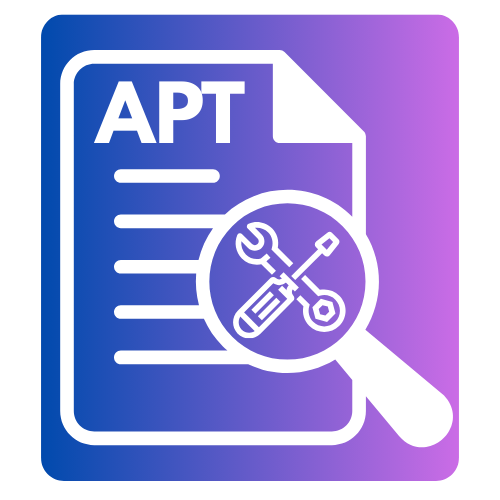

# Accessible PDF Toolkit (APT)

<p align="center">
  
</p>

<p align="center">
  <strong>Make your PDFs easy for everyone to read!</strong>
</p>

<p align="center">
  <a href="#what-is-this-app">What Is This?</a> •
  <a href="#how-to-install">How to Install</a> •
  <a href="#how-to-use">How to Use</a> •
  <a href="#need-help">Need Help?</a>
</p>

---

## What Is This App?

The **Accessible PDF Toolkit** helps you make PDF files easier for everyone to read. This includes people who:

- Use **screen readers** (software that reads text out loud)
- Have **trouble seeing**
- Need documents to follow **accessibility rules**

### Your Files Stay Private!

This app runs on **your computer only**. Your files never leave your machine. This makes it safe for:
- Student records (FERPA)
- Medical information (HIPAA)
- Any private documents

---

## What Can This App Do?

| Feature | What It Does |
|---------|--------------|
| **Check PDFs** | Find problems that make PDFs hard to read |
| **Fix PDFs** | Add image descriptions, proper headings, and accessibility tags |
| **AI Helper** | Get smart suggestions from AI that runs on YOUR computer |
| **Export HTML** | Turn PDFs into accessible web pages (via File menu) |
| **Stay Private** | Everything stays on your computer - nothing goes online! |

---

## How to Install

### Step 1: Download the Files

1. Click the green **Code** button at the top of this page
2. Click **Download ZIP**
3. Find the ZIP file in your Downloads folder
4. Double-click the ZIP file to open it

### Step 2: Install Python

This app needs Python to run.

**On Mac:**
1. Open **Terminal** (search for "Terminal" using Spotlight - press Cmd+Space)
2. Copy this command and press Enter:
   ```bash
   brew install python
   ```
   If that doesn't work, go to [python.org](https://www.python.org/downloads/) and download Python.

**On Windows:**
1. Go to [python.org/downloads](https://www.python.org/downloads/)
2. Click the big yellow **Download Python** button
3. Run the file you downloaded
4. **IMPORTANT:** Check the box that says **"Add Python to PATH"**
5. Click **Install Now**

### Step 3: Set Up the App

1. Open **Terminal** (Mac) or **Command Prompt** (Windows)
   - Mac: Search for "Terminal"
   - Windows: Search for "cmd"

2. Go to the folder you downloaded:
   ```bash
   cd ~/Downloads/Local-Accessible-PDF-Toolkit-main
   ```

3. Create a safe space for the app:
   ```bash
   python3 -m venv venv
   ```

4. Turn on that safe space:

   **Mac:**
   ```bash
   source venv/bin/activate
   ```

   **Windows:**
   ```bash
   venv\Scripts\activate
   ```

5. Install what the app needs:
   ```bash
   pip install -r requirements.txt
   ```

### Step 4: Run the App

Type this and press Enter:
```bash
python launcher.py
```

**The app will open!** You'll see a login screen with the APT logo.

---

## How to Use

### First Time: Make an Account (or Skip It)

When the app opens:

1. Click the **Register** tab
2. Pick a **username** (any name you like)
3. Add your **email** (you can skip this)
4. Pick a **password** (at least 6 letters or numbers)
5. Type the password again
6. Click **Create Account**

**Don't want to make an account?** Click "Continue without login" at the bottom.

---

### Opening a PDF File

**Way 1: Drag and Drop (Easiest!)**
1. Find your PDF file
2. Drag it into the app
3. Drop it on the "Drop PDF Here" area

**Way 2: Click Browse**
1. Click **Import PDF**
2. Find your file
3. Click **Open**

---

### The 3 Tabs

The app has 3 tabs on the left side:

#### 1. Dashboard
- See all your recent PDFs
- Drag files here to open them
- Click any file to work on it
- View compliance statistics

#### 2. PDF Viewer
- See your PDF with colored highlights
- AI-powered accessibility analysis
- Apply suggested fixes directly
- Colors show what needs fixing:
  - 🟣 **Purple** = Headings
  - 🟡 **Yellow** = Images that need descriptions
  - 🟢 **Green** = Tables
  - 🟠 **Orange** = Links
  - 🔴 **Red** = Problems to fix

#### 3. Settings
- Pick your AI helper (Ollama, LM Studio, etc.)
- Change how the app looks
- Configure accessibility checking options
- Set batch processing preferences

---

### Keyboard Shortcuts

Press these keys to work faster:

| Press These Keys | What Happens |
|-----------------|--------------|
| Ctrl+1 | Go to Dashboard |
| Ctrl+2 | Go to PDF Viewer |
| Ctrl+3 | Go to Settings |
| Ctrl+O | Open a PDF file |
| Ctrl+S | Save your work |
| Ctrl+E | Export to HTML |
| Ctrl+Shift+V | Validate WCAG compliance |
| Ctrl+Space | Get AI suggestions |

---

## Setting Up AI (Optional but Helpful!)

The app can use AI to suggest fixes. The AI runs on your computer, so your files stay private.

### Install Ollama (Recommended - It's Free!)

1. Go to [ollama.ai](https://ollama.ai)
2. Click **Download**
3. Install it like any other app
4. Open Terminal and type:
   ```bash
   ollama pull llama3.2
   ```
5. Wait for it to download (this takes a few minutes)

### Tell the App to Use Ollama

1. Open the app
2. Go to **Settings** (Ctrl+5)
3. Click **AI Backend** tab
4. Make sure **Ollama** is selected
5. Click **Test Connection** - you should see a green checkmark!

---

## Building a Desktop App (Advanced)

Want an app you can double-click to open? Do this:

1. Make sure you have PyInstaller:
   ```bash
   pip install pyinstaller
   ```

2. Build the app:
   ```bash
   pyinstaller accessible-pdf-toolkit.spec
   ```

3. Find your new app in the **dist** folder!

---

## Need Help?

### Common Problems

**"Python not found"**
- Install Python (see Step 2 above)
- On Windows, make sure you checked "Add Python to PATH"

**App won't start**
- Make sure you ran `source venv/bin/activate` (Mac) or `venv\Scripts\activate` (Windows)
- Try running `pip install -r requirements.txt` again

**AI doesn't work**
- Make sure Ollama is running
- Go to Settings → AI Backend → Click "Test Connection"

### Still Stuck?

[Click here to ask for help](https://github.com/Tech-Inclusion-Pro/Local-Accessible-PDF-Toolkit/issues)

---

## Privacy Promise

Your files are **100% private**:

- PDFs **never** leave your computer
- AI runs **locally** on your machine
- **No data** is sent to the internet
- Safe for **sensitive documents**

---

## Technical Details

### What's Inside

- **PyMuPDF** - Reads and writes PDF files
- **pikepdf** - Adds accessibility tags
- **Tesseract OCR** - Reads text from scanned documents
- **PyQt6** - Makes the app look nice
- **Ollama/LM Studio** - Provides AI features

### WCAG Compliance

This app checks your PDFs against WCAG 2.1/2.2 Level AA:

| What We Check | Why It Matters |
|---------------|----------------|
| Document title | Screen readers announce it |
| Headings | Helps people navigate |
| Image descriptions | Describes pictures for blind users |
| Table headers | Makes data tables understandable |
| Link text | "Click here" doesn't help - we fix that! |
| Reading order | Content should flow logically |

---

## Credits

Made with ❤️ by **Rocco Catrone** of **Tech Inclusion Pro, LLC**

Helping make the digital world accessible to everyone!

---

## License

MIT License - Free to use!

---

<p align="center">
  
  <br/>
  <strong>Accessible PDF Toolkit</strong>
  <br/>
  Making PDFs accessible, one document at a time.
</p>
